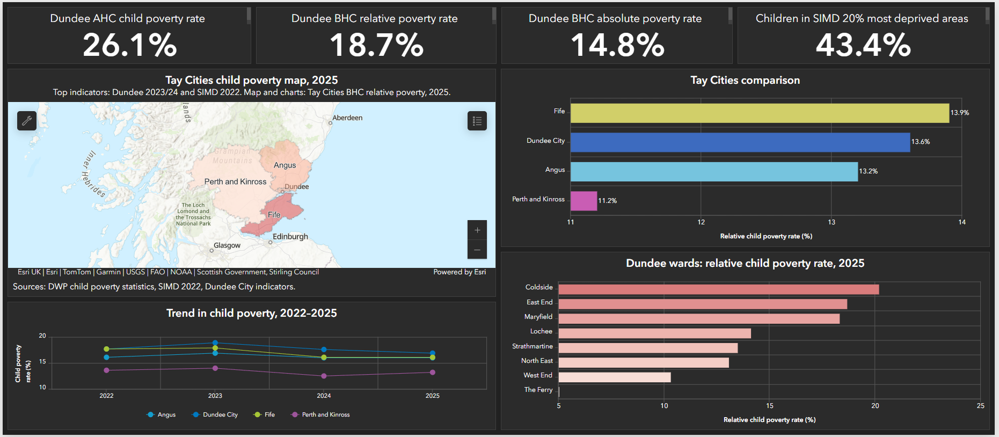

# Investigating Deprivation and Community Intervention in Dundee

Portfolio case study from a group data science project using GIS, dashboards, spatial mapping and data storytelling to explore deprivation, child poverty, mental health pressures, substance-related harm and community intervention in Dundee.

This project was completed as the final group data analysis project for the Women and Future Skills Programme, Dundee 2025-2026, contributing to SCQF Level 8 Data Science accreditation.

## Full Project Report

[Download the full PDF report](report/Investigating_Deprivation_and_Community_Intervention_in_Dundee.pdf)

## Project Overview

Dundee faces significant challenges linked to deprivation, child poverty, mental health pressures and substance-related harm. At the same time, the city has many community support services, but they can be difficult to find, poorly signposted, or unavailable in one accessible place.

Our project explored this problem from two connected directions.

First, we used open data, statistical analysis, GIS mapping and dashboards to examine patterns of deprivation, health outcomes and intervention across Dundee and the wider Tay Cities region.

Second, we responded to a practical community need raised by Parish Nursing Dundee: the need for an accessible digital and printable resource to help frontline workers and service users find local support services by day, category and type of support.

## My Contribution

My role in the group project was **GIS Lead**.

I contributed to:

- GIS mapping
- ArcGIS dashboard presentation
- StoryMap/persona visualisation
- public-facing design
- visual storytelling using ArcGIS Online and Canva

## Project Aims

The project had two main aims:

1. **Analytical aim**  
   To use open data to map and analyse deprivation, child poverty, mental health pressures, alcohol-related harm, substance-related harm and intervention patterns across Dundee.

2. **Practical aim**  
   To explore how a digital community support map and printable resource could help people and frontline workers identify services available on a specific day, improving signposting and access to support.

## Key Themes

- Child poverty and deprivation
- Mental health inequalities
- Alcohol-related and substance-related harm
- Community support services
- Service accessibility and signposting
- GIS mapping and dashboards
- StoryMap/persona-based data storytelling
- Recovery Map prototype development
- Community intervention and social impact

## Tools and Methods

The project used a combination of analytical, visual and practical tools:

- ArcGIS Online
- Canva
- Power BI
- Microsoft Excel
- Python
- HTML, CSS and JavaScript
- Leaflet.js
- OpenStreetMap
- GitHub
- Public open datasets
- Dashboard design
- StoryMap/persona storytelling
- Community stakeholder engagement

## Project Outputs

The project produced a range of analytical and public-facing outputs:

- Full project report
- Child poverty ArcGIS dashboard
- Mental health inpatient analysis
- Alcohol-related hospital admission analysis
- Drug and alcohol service performance dashboard
- Local mental health service performance analysis
- Community support services dashboard
- ArcGIS StoryMap and personas
- Dundee Recovery Map prototype
- Recovery leaflet/poster redesign
- Public-facing project poster

## Key Findings

### Child Poverty and Deprivation

The child poverty dashboard showed that child poverty in Dundee is part of a wider pattern of place-based inequality. The report highlights that 26.1% of children in Dundee were living in poverty after housing costs, and 43.4% of children were living in areas ranked within the 20% most deprived areas according to SIMD.



### Mental Health

The mental health analysis found that Dundee City has experienced persistently higher mental health inpatient hospitalisation rates than Scotland overall for more than two decades. The gap is mainly driven by psychiatric admissions, and Dundee recorded the highest mental health inpatient rates among Scottish council areas in 2023/24.

### Alcohol-Related and Substance-Related Harm

The alcohol-related hospital admissions analysis found that Dundee City has experienced persistently higher alcohol-related hospital admission rates than both Scotland overall and neighbouring Tayside councils. The gap is strongest for alcohol-related mental and behavioural disorder admissions.

### Community Support Services

The community service mapping showed that many services are free and broadly accessible, but there are still barriers around opening times, visibility, demographic targeting and unclear information. Weekend provision is more limited than weekday provision, which may create difficulties for people who need support outside normal working hours.

### StoryMap and Personas

The StoryMap was created as a public-facing output to make the project easier to understand for non-technical audiences. The personas do not represent real individuals, but they illustrate how poverty, mental health challenges, addiction, trauma, social isolation and housing insecurity can affect access to support.


The StoryMap links the evidence base to the practical output of the project: a Recovery Map prototype designed to help users identify available local services by day, category and type of support.


## Dundee Recovery Map Prototype

The Recovery Map prototype was developed in response to a practical request from Parish Nursing Dundee. Parish Nurses explained that people often need support immediately, and that being signposted to a service that is closed or unavailable can mean the opportunity for engagement is lost.

The prototype demonstrates how local services could be filtered by:

- day of the week
- service type
- category
- target group
- cost
- access type
- location

The prototype was designed as a static web application using open-source tools, with the potential for no-cost hosting through GitHub Pages. It also highlighted the importance of maintaining accurate and up-to-date service information.

## Project Poster

The project poster summarises the purpose, findings and practical value of the project.


## Responsible Sharing Note

This repository is a public portfolio version of a group project. It is shared for educational and professional portfolio purposes.

Private group files, raw datasets, personal information and unverified service data are not included here. The full Recovery Map prototype and underlying service dataset would require further review and verification before any public deployment.

## Repository Structure

```text
README.md
report/
   Investigating-Deprivation-and-Community-Intervention-in-Dundee.pdf

images/
   Dashboard_upd.png
   Story_Map_1.png
   Story_Map_Persona.png
   How_Local_Support_Changes_Lives.png
   Story_Map_2.png
   Poster_Road_Map.png
