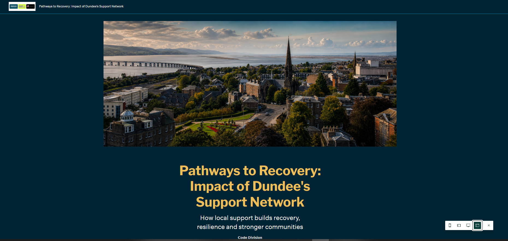
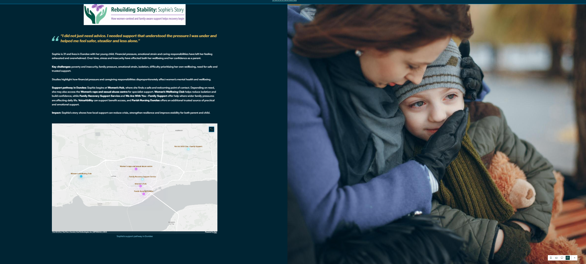
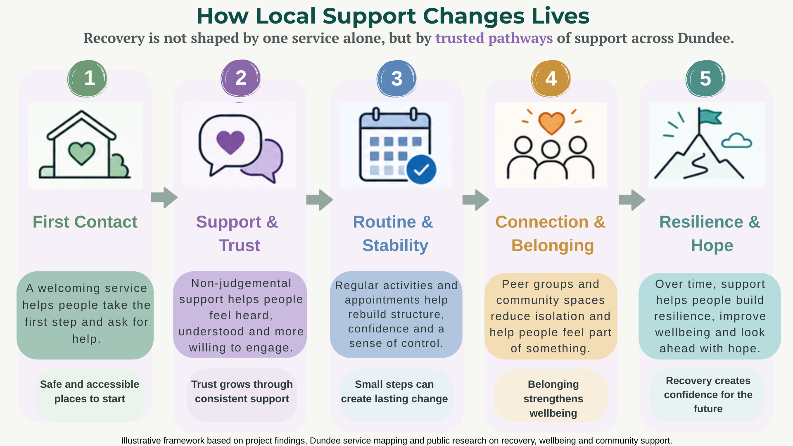
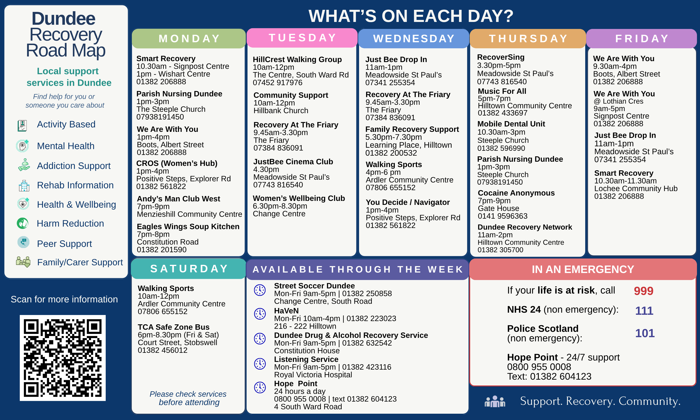

# dundee-community-intervention-portfolio
Portfolio case study: GIS, dashboards and data storytelling project on deprivation and community intervention in Dundee.
# Draft Report
# Working Title

### Table of Contents

- [Background](#background)
- [Impact](#impact)
- [Legal, Social, Ethical, and Professional Issues](#legal-social-ethical-and-professional-issues)
- [Equality, Diversity, and Inclusion Considerations](#equality-diversity-and-inclusion-considerations) 
- [Deprivation](#deprivation)
  - [Child Poverty](#child-poverty)
  - [Mental Health](#mental-health)
  - [Substance-Abuse](#substance-abuse)
 
- [Intervention](#intervention)
  - [Programmes](#programmes)
  - [Community Centres](#community-centres)
 
- [Parish Nursing Dundee](#parish-nursing-dundee)
  - [Mapping and Analysis of Community Support Service Accessibility and Provision](#mapping-and-analysis-of-community-support-service-accessibility-and-provision)
  - [Dundee Recovery Map Prototype](#dundee-recovery-map-prototype)
 

Project overview

We are a group of six women from the Women in Future Skills Programme who were all keen to apply the data science skills we developed over six months on the Level 8 Data Science course with Code Division to a meaningful real-world project.

From the outset, we approached the project with the goal of conducting analysis that would not only demonstrate the technical skills we had learned throughout the programme, but also provide something genuinely useful to the communities in which we live and work. During our initial discussions, we identified Dundee’s ongoing challenges relating to child poverty, mental health pressures, deprivation, and substance-related harm as key areas of focus.

Our project developed around two connected goals. The first was analytical: using open data to explore deprivation, health outcomes, and the reach and impact of intervention programmes across Dundee and the wider Tay Cities region. The second was practical: responding to a request from Parish Nursing at the Steeple Church Dundee to help rebuild a digital community resource that had previously existed but had become unaffordable to maintain.

Our analytical work involved a range of data science and visualisation approaches across multiple platforms. This included comprehensive Python analysis of drug- and alcohol-related trends; a Power BI dashboard exploring Dundee service provision; an Excel dashboard examining drug and alcohol prevention statistics; an ArcGIS child poverty dashboard visualising prevention impact; and an Excel/Power BI analysis of the Alcohol and Drug Partnership (ADP) Framework relating to substance-related harm.

The practical side of the project was shaped through direct engagement with community organisations. We became aware of the need for an improved and accessible map of local support services because one group member wanted to contribute an analysis of support provision in Dundee. Through her daughter, a trainee mental health nurse who had completed a placement with the Parish Nurses at the Steeple Church, she learned about the original “Recovery Road Map” developed by Parish Nursing Dundee.

We contacted the Parish Nurses and met with Kirsty Nelson, Parish Nurse, to explore how our project and developing data science skills might support both the Parish Nursing service and the wider community.

During this meeting, Kirsty explained that the original Recovery Road Map - a free digital tool displaying local support services - had been taken offline due to ongoing costs. She also highlighted several practical improvements that would make the resource significantly more useful for frontline staff and service users.

One of the most important issues raised was the need for users to search services by day of the week. Kirsty explained that many individuals accessing support required help immediately, “there and then,” and it could be discouraging or distressing when services they were signposted to were unavailable that day. She also suggested including additional resources such as food provision, individual Narcotics Anonymous and Alcoholics Anonymous meetings, and other forms of crisis and recovery support.

Kirsty further explained that local police officers would also benefit from such a tool, as they frequently brought vulnerable individuals to Parish Nursing for immediate signposting to services available on that particular day. Importantly, she reminded us that digital access cannot be assumed for everyone. While an online map would be valuable, she stressed the importance of also having an offline printable poster listing services by day, recognising that not everyone has access to a smartphone or the internet.

Another key challenge identified was sustainability. Kirsty described how maintaining the original map had effectively become the responsibility of one individual, which was difficult to sustain alongside the demands of frontline nursing work. This discussion prompted us to think not only about building a useful digital tool, but also about designing something more collaborative and maintainable long term.

Following this meeting, we explored how a redesigned map could allow services to be filtered by day of the week, service type, and target demographic, while also potentially allowing individual organisations to update their own information directly, reducing the burden on any one person to maintain the system.

Kirsty then connected us with Gabriel Calvert, Recovery Coordinator at Dundee Voluntary Action. We met with Gabriel to demonstrate an early prototype of the map and discuss how it might work in practice. Gabriel provided valuable feedback and suggested several refinements, which we incorporated into the design.

As the project evolved, we built a working interactive web prototype using free open-source tools, with the potential for zero-cost deployment. The prototype was supported by a full Python data pipeline using information gathered on more than 400 services across Dundee. The data was cleaned, geocoded, and structured into a JSON dataset powering a live interactive service map.

Alongside the digital prototype, we also redesigned an updated printed leaflet in Canva and developed an ArcGIS “user story” presentation illustrating the experiences of three hypothetical service users engaging with Parish Nursing and related support services, helping to demonstrate the potential real-world impact of accessible signposting and joined-up community support.

Towards the end of the project, we met again with Kirsty and Gabriel, alongside Frank and Bianca, to demonstrate the working prototype and discuss possibilities for future development.

The project ultimately resulted in a range of practical and analytical outputs designed to support both community accessibility and evidence-based understanding of local challenges.

These outputs included a complete working service-mapping prototype that allows users to filter services by day of the week, service type, and focus demographic. The prototype was designed so that the map updates automatically whenever the underlying service provision dataset is updated, helping to improve long-term sustainability and reduce the need for manual maintenance.

Alongside the digital prototype, we also produced a physical poster listing services by day of the week to improve accessibility for individuals without reliable internet or smartphone access.

To help communicate the human impact of service provision and accessibility, we developed a comprehensive “user story” presentation illustrating the experiences of hypothetical individuals navigating support systems within Dundee.

In addition, the project included extensive analytical work exploring public datasets relating to drug and alcohol trends, child poverty and deprivation, mental health, and wider health inequalities across Dundee and the Tay Cities region. We also carried out detailed analysis of local service provision using the dataset underpinning the mapping prototype, enabling us to identify patterns, gaps, and areas of concentrated support across the region.

Looking ahead, we would be very keen to continue developing the project further by expanding the geographical coverage and including additional service types. Gabriel also suggested that, in future, the platform could potentially evolve into a broader “What’s On in My Neighbourhood” community resource, helping individuals identify not only crisis and recovery services, but also wider opportunities for social connection, wellbeing support, and community engagement within their local area.

We would also want to engage directly with organisations individually to verify that service information remains current and to encourage shared responsibility for maintaining and updating the platform as services evolve over time.

Overall, the project allowed us not only to apply the technical skills gained throughout the programme, but also to experience how data science can support real community needs when developed collaboratively, thoughtfully, and with an understanding of the human realities behind the data.

## Background
This project was undertaken as the final group data analysis project for the Women and Future Skills Programme, Dundee, 2025. Our group of six approached the project with goal to conduct analysis that not only demonstates the skills we have learned during the programme, but to also provide valuable infomation to the communities we live and work within. From our initial discussions, we identified Dundee's challenges of child poverty, mental health pressures, and substance-related harm as a focus area.

Our project work comprises two goals: The first is analytical, by using open data to map deprivation, health outcomes, and the reach of intervention programmes across the city. The second is practical, responding to a direct request from Parish Nursing Dundee - a community organisation, to help them rebuild a digital tool that was previously available but became unaffordable to maintain. These two goals are not separate, as the analysis we have conducted provides the evidence base that demonstrates why the tool matters, and the tool itself represents a practical response to the challenges the analysis reveals.

We are a team of women at various stages of retraning and upskilling in data skills. We have tried to approach this work with the same care we would want applied if our own communities were being studied by framing our findings constructively, and focusing on what is working and where oportunity lies, and treating the data not as abstract statistics but as descriptions of real people's lives and experinces. 

## Impact

### StoryMap and Personas

The StoryMap was created as a public-facing output to make the findings of the project easier to understand for non-technical audiences. While the technical report presents detailed analysis, the StoryMap uses a more visual and narrative format to show how deprivation, child poverty, mental health pressures, substance-related harm, and access to support services are connected in Dundee.

*Impact Figure 1. StoryMap opening page introducing the project focus and Dundee context.*

The personas were included to help connect the data with realistic service-user experiences. They do not represent real individuals, but they help illustrate how people facing poverty, mental health challenges, addiction, social isolation, or housing insecurity may experience barriers when trying to find support.

*Impact Figure 2. Persona section showing how the StoryMap connects the analysis with realistic community experiences.*

The persona journey shows why timely and accessible information matters. A person may be willing to seek help only at a particular moment, so unclear opening times, unknown eligibility, or outdated service information can become a practical barrier to support.

*Impact Figure 3. Persona journey showing how service access barriers can affect people seeking support.*

The StoryMap links the evidence base to the practical output of the project: a Recovery Map prototype that helps users identify available local services by day, category, and type of support.

*Impact Figure 4. StoryMap section showing how the Recovery Map prototype responds to the needs identified in the analysis.*
 
## Legal, Social, Ethical, and Professional Issues
Data projects involving sensitive public health and social information carry significant responsibilities. Our project covers child poverty, substance use, and mental health, which are all issues affecting real people, and so our analysis was conducted with care and respect to related legal, social, ethical, and professional considerations.

Legally, all datasets used are published under the [Open Government Licence v3.0 (OGL)](https://www.nationalarchives.gov.uk/doc/open-government-licence/version/3/), permitting free use and adaptation provided the source is acknowledged. Every dataset is recorded in our data source tracker with its licence confirmed before use. No personal or individual-level data is used in this project. All analysis is conducted on data aggregated to datazone, council area, or NHS Board level, ensuring that no individuals can be identified. Where data providers have applied suppression to small counts, we have respected this and acknowledged them as limitations rather than attempting to infer hidden values from surrounding data.

Socially, the topics that our project investigates, including drug-related deaths, mental health crises, and child poverty are all real, lived experiences, and so our analysis focuses solely on systemic factors: poverty, trauma, inadequate access to service services, and other structural inequalities. It does not focus on individual choices or behaviours, and avoids language or framing that could reinforce any stigma that already surrounds these issues.

Ethically, we are clear about what our analysis can and cannot claim. Where we identify any relationship between variables, we acknowledge that this is a statistical association, not proof of causation. We also acknowledge that some of our data, including SIMD 2020, is over five years old and may not fully reflect communities that have changed since then. We supplement it with more recent sources where available, including the Dundee Poverty Profile 2025, and Public Health Scotland's most recent publications.

Professionally, all analysis performed is reproducible. Python notebooks are clean, fully commented, and executable top to bottom. Every statistic and claim in this report is traceable to a cited source in the data source tracker. Code and documents are version-controlled in our shared GitHub project repository. As learners conducting an educational project rather than professional researchers, our recommendations are presented as suggestions for consideration - not definitive policy conclusions, and our findings are reported with appropriate modesty about their scope and authority.

## Equality, Diversity, and Inclusion Considerations
These considerations ask us to reflect on who is represented in our data and analysis, whose voices are absent, and whether our research treats all groups fairly. Our data tells us where deprivation, poor health outcomes, and service gaps are concentrated geographically, but it cannot easily tell us how those experiences differ across gender, ethnicity, disability, or other individual characteristics within the same area. We acknowledge this limitation throughout and do not treat poverty or poor health as uniform experiences. The people most affected by the issues we analyse, including those experiencing poverty, substance use, or mental health crises are not directly present in our analysis [though possibly will be as part of our StoryMap/persona?] We also note this explicitly, and recognise that any meaningful, lasting improvement to service provision in Dundee and the other Tay cities will require cooperation with affected communities, not analysis of them alone.

All our outputs are designed to be accessible, we provide plain-English labels and descriptions throughout all visualisations, along with contextualising statistics so that a member of the public without a data background can easily understand our findings. Lastly, as a team of women at various stages of retraining in data skills, working on a project about communities we live in and care about, we also acknowledge that our own backgrounds and perspectives inevitably shape the questions we ask, the framings we choose, and the emphasis we give to particular findings. We have tried to be conscious of this throughout.

## Deprivation

### Child Poverty
Child poverty became one of the main themes in our project because it is closely connected to many of the wider challenges affecting Dundee and the Tay Cities, including deprivation, housing insecurity, mental health pressures, educational inequality, and uneven access to support services. Looking at child poverty gave us a clear way to bring these connected issues together and to show that they should not be treated in isolation.
As part of the project, we developed a child poverty dashboard to bring key indicators, local patterns, and regional comparisons into one visual tool. We wanted the dashboard show how child poverty varies by place, how it overlaps with deprivation, and why local context matters when interpreting the figures.

The dashboard brings together several related measures. These include Dundee's child poverty rate after housing costs, child poverty rate before housing costs, absolute child poverty rate before housing costs, and the percentage of children living in the 20% most deprived areas according to the Scottish Index of Multiple Deprivation. It also includes comparison data for Angus, Dundee City, Fife, and Perth and Kinross, alongside ward-level child poverty data for Dundee and trend data showing how rates have changed across the Tay Cities over time.

These measures were compiled from publicly available national and local sources, including Dundee City Council publications, Dundee poverty profile data, Department for Work and Pensions child poverty statistics, and SIMD-based deprivation data. Bringing these sources together allowed us to move from a single headline figure to a more rounded view of how child poverty is experienced across the area.
The dashboard clearly shows that child poverty in Dundee forms part of a wider pattern of inequality rather than being a stand-alone issue. The headline figures show that 26.1% of children in Dundee were living in poverty after housing costs, 18.7% were living in relative poverty before housing costs, 14.8% were living in absolute poverty before housing costs, and 43.4% of children were living in areas ranked within the 20% most deprived SIMD areas.
These figures are important for two reasons. First, they show the extent to which housing costs affect the reality of poverty for families. Second, they show that a large proportion of Dundee's children are growing up in neighborhoods where disadvantage is already concentrated.

The comparison charts place Dundee within the wider Tay Cities context. They show how Dundee compares with Angus, Fife, and Perth and Kinross, while the ward-level analysis highlights that child poverty is not evenly distributed across the city. In our local dashboard, wards such as Coldside, East End, and Maryfield emerge as areas facing the greatest pressure, while The Ferry and West End show substantially lower levels.
The trend view adds a further layer by showing how child poverty rates changed between 2022 and 2025 across the Tay Cities authorities. This helps distinguish between short-term movement in the data and more persistent patterns over time. From a political point of view, this matters because long-term inequality requires a different response from a temporary rise or fall in the figures.

Taken together, the dashboard functions as an evidence tool rather than just a visual output. It brings together city-wide indicators, regional comparison, and neighborhood-level analysis in a way that is accessible and practical. More importantly, it supports one of the central points of our project: child poverty should not be understood as a single number in isolation, but as a place-based and multi-dimensional issue shaped by deprivation, family circumstances, housing pressures, health, and access to support.

*Figure 1. ArcGIS dashboard presenting child poverty indicators for Dundee and the wider Tay Cities area.*

## Mental Health

## Mental Health Inpatient Hospitalisations in Scotland: focus on Dundee City (1997/98–2023/24)

**Technical report**

### 1. Aim of the analysis

This analysis examines long-term trends in mental health inpatient activity in Scotland, with a specific focus on Dundee City. The main aim is to assess how Dundee compares with Scotland overall and whether differences persist over time.

The analysis also explores:
	
- Differences between psychiatric and non-psychiatric admissions.
- Dundee’s position relative to other council areas in 2023/24.
- Whether observed patterns are driven by a specific type of inpatient activity or are more general across mental health care.

### 2. Data and methods

**Data sources**

The analysis used Mental Health Inpatient and Day Case Statistics (MHRHS), covering Scottish general and psychiatric hospitals from financial year 1997/98 to 2023/24.

Although the source dataset includes day cases, this analysis focuses exclusively on inpatient activity.

Patient rates are reported per 100,000 population. Council-level rates are taken directly from the published datasets. Scotland-level rates are derived by averaging age-specific patient rates to provide a consistent national comparator.

Rates are suitable for comparison over time and between areas within Scotland, but they are not directly equivalent to European age-standardised rates.

Two datasets were used:
- Council area–level patient rates by admission type
- National age- and sex-specific rates, used to derive Scotland-level comparisons

**Data preparation**

- Council area codes were mapped to readable council names.
- Admission types were grouped as:
  - Psychiatric (SMR04)
  - Non-psychiatric (SMR01)
  - Combined (total inpatient activity)
- Quality flag variables and unused fields were removed.
- Data types were checked and standardised.
- Cleaned datasets were exported for reproducibility.

**Study design**

- Main comparisons focus on Dundee City versus Scotland.
- Trends were assessed over the full period (1997/98–2023/24).
- Analyses primarily use combined psychiatric and non-psychiatric admissions unless stated otherwise.
- Additional breakdowns examine psychiatric and non-psychiatric trends separately.
- A difference analysis (Dundee minus Scotland) was used to quantify excess inpatient rates.
- A council-level comparison was produced for 2023/24.
- The analysis is descriptive; no statistical modelling was applied.

**How Scotland-level and council-level rates were calculated**

Scotland-level rates were calculated from age-specific national data by averaging patient rates across age groups for each year. Council-level rates, including Dundee City, were taken directly from the council-area dataset and averaged where needed within each year.

Both sets of rates:
- Use the same underlying national dataset
- Apply consistent admission definitions
- Cover the same time period

Minor technical differences in aggregation do not affect the overall patterns or conclusions.

### 3. Results

#### 3.1 Overall trends: all mental health inpatient admissions in Dundee City vs Scotland (Figure 1)

Mental health inpatient rates have changed substantially over time in both Dundee City and Scotland.
Across the full time period, Dundee City records consistently higher mental health inpatient rates than the Scottish average.

Although rates decline in both Dundee and Scotland over time, the gap between Dundee and the national average persists, indicating a long-standing difference rather than short-term variation. This indicates that Dundee’s higher rates are not driven by short-term fluctuations but reflect longer-standing differences in population need, service use, or both.

**Figure 1. Mental health inpatient rates (total cases), Dundee City vs Scotland, 1997/98–2023/24**

Standardised patient rates per 100,000 population for total inpatient activity (combining psychiatric and non-psychiatric admissions).

#### 3.2 Dundee City: psychiatric vs non-psychiatric activity (Figure 2)

Within Dundee City, both psychiatric and non-psychiatric admissions contribute to overall inpatient activity.
Psychiatric admissions show higher and more variable rates over time, while non-psychiatric admissions occur at substantially lower levels and show more modest change.

Overall trends in Dundee are therefore driven primarily by psychiatric inpatient activity.

**Figure 2. Psychiatric vs non-psychiatric inpatient rates in Dundee City, 1997/98–2023/24**

Standardised patient rates per 100,000 population for psychiatric and non-psychiatric mental health inpatient admissions in Dundee City.

#### 3.3 Excess mental health inpatient admissions in Dundee relative to Scotland (Figure 3)

By subtracting the Scottish inpatient rate from the Dundee rate, the analysis highlights the size and persistence of Dundee’s excess mental health inpatient hospitalisations.

The difference between Dundee and Scotland remains positive across most of the time period.
Dundee rarely falls below the national average. The size of the gap varies over time but remains persistent.
This indicates a sustained inequality in mental health inpatient burden.

**Figure 3 Excess mental health inpatient hospitalisation rates in Dundee City relative to Scotland, 1997/98–2023/24**

Difference in standardised mental health inpatient rates per 100,000 population (Dundee minus Scotland).

Values above zero indicate higher rates in Dundee than the national average. The dashed horizontal line marks parity with the national average.

#### 3.4 Psychiatric-only mental health admissions: Dundee City versus Scotland (Figure 4)

For psychiatric mental health admissions, both Dundee and Scotland show marked decrease over time.

For psychiatric admissions only, Dundee records consistently higher psychiatric inpatient rates across most of the time series, suggesting sustained pressure on specialist mental health services relative to the national picture.

**Figure 4. Psychiatric inpatient rates, Dundee City vs Scotland, 1997/98–2023/24**

#### 3.5 Non-psychiatric mental health admissions: Dundee City versus Scotland (Figure 5)

For non-psychiatric mental health admissions, rates are substantially lower than for psychiatric admissions in both Dundee and Scotland.

Although Dundee remains above the national average in most years, the difference is smaller than for psychiatric admissions. This reinforces the finding that psychiatric inpatient care is the main driver of Dundee’s relative excess.

**Figure 5. Non-psychiatric inpatient rates, Dundee City vs Scotland, 1997/98–2023/24**

#### 3.6 Dundee within Scotland: council area comparison, 2023/24 (Figure 6)

Council-level comparisons for 2023/24 show wide variation in mental health inpatient hospitalisation rates across Scotland.

In 2023/24, council-level variation is clear.

- Dundee City records the highest inpatient rates in Scotland.
- Fife records the 2nd highest inpatient rates in Scotland.
- Neighbouring councils such as Angus and Perth and Kinross record lower rates and sit closer to the national average.
- Many council areas cluster closer to the national average.

This pattern indicates that Dundee’s higher inpatient rates are not shared evenly across the region and are not simply a feature of Tayside as a whole.

**Figure 6. Mental health inpatient hospitalisation rates by council area, Scotland, 2023/24**

Standardised patient rates per 100,000 population for combined psychiatric and non-psychiatric mental health inpatient admissions. Dundee City is highlighted in red, Tayside cities are highlighted in blue, and Scottish average shown for reference.

### 4. Alignment with policy and system changes (context, not causation)

Several major changes in mental health policy and service delivery occurred during the study period. While this analysis cannot establish causality, the observed trends align in time with key system shifts.

**Late 1990s to early 2000s: higher inpatient use**

- Greater reliance on inpatient care for mental health conditions
- Fewer community-based alternatives
- Higher levels of unmet need in deprived urban areas

**Mid-2000s to 2010s: declining inpatient admissions**

- Expansion of community mental health teams
- Policy focus on care in the community rather than hospital settings
- Reductions in psychiatric bed numbers across Scotland

**Recent years: persistent local inequalities**

- Overall inpatient rates remain lower than historic levels
- Dundee continues to record higher rates than Scotland overall
- Suggests that service redesign alone has not removed underlying differences in need

Overall inpatient rates have declined substantially since the early 2000s, consistent with national policy shifts towards community-based mental health care and reductions in psychiatric bed numbers. However, Dundee continues to record higher inpatient rates than Scotland overall, particularly for psychiatric admissions. The persistence of this difference over more than two decades suggests long-standing, place-based factors operating alongside national trends in service provision, rather than short-term or policy-specific effects.

### 5. Limitations

This analysis has several limitations:

#### 5.1.	Descriptive analysis only

No statistical testing or causal inference was performed.

#### 5.2.	Hospital-based data

The analysis captures inpatient and day case activity only and does not reflect community mental health care, primary care contacts, or unmet need.

#### 5.3.	No adjustment for deprivation or morbidity

Differences may reflect population health and socioeconomic factors rather than service performance.

#### 5.4.	Changes in service models over time

Reductions in inpatient rates may reflect policy-driven changes in care pathways rather than changes in mental health prevalence.

#### 5.5.	Scotland-level estimates

Scotland-level estimates are derived from age-structured data rather than a directly equivalent council dataset.

#### 5.6.	Differences in dataset structure 

Differences in dataset structure may introduce minor inconsistencies in absolute values.

### 6. Conclusion

Dundee City has experienced persistently higher mental health inpatient hospitalisation rates than Scotland overall for more than two decades.

**Key findings include:**

- Dundee’s excess inpatient rates are long-standing and sustained.
- The gap is driven primarily by psychiatric admissions.
- National inpatient rates have declined, but local inequalities remain.
- Neighbouring Tayside councils do not show the same level of inpatient activity.

National mental health reforms have reduced reliance on inpatient care across Scotland but have not eliminated persistent local differences. Addressing mental health inequalities in Dundee is therefore likely to require targeted, place-specific approaches alongside national policy initiatives.

---
### Local Mental Health Service Performance and Geographical Inequality (2022–2025)
 
This analysis examines mental health service activity across Dundee's Local Community Planning Partnership (LCPP) areas between 2022 and 2025, with a focus on access to psychological therapies, emergency hospital admissions, regional disparities, and demographic trends. The analysis was carried out in Microsoft Excel, and the underlying data was taken from the Dundee Health and Social Care Partnership's *Mental Health Services Indicators 2025–26 Quarter 2* report, published by the Chief Finance Officer and presented to the Performance and Audit Committee. The dashboard below brings together the key findings in a single visual summary.

 
 
*Figure. Dundee Mental Health Crisis: Access and Admission Analysis Dashboard (2022–2025). Analysis conducted in Microsoft Excel. Data source: Mental Health Services Indicators 2025–26 Quarter 2 (Dundee Health and Social Care Partnership).*
 
---
 
#### System Efficiency: Target vs Actual Waiting Times

The target-versus-actual chart tracks the proportion of patients referred to Psychological Therapies who began treatment within 18 weeks of referral. The Scottish Government standard requires that 90% of patients commence treatment within this window. Across the period from 2022/23 Quarter 1 through to 2024/25 Quarter 2, Dundee's actual performance declined from 75% to 70.4%, sitting consistently and significantly below the 90% aim line.
 
Dundee is one of seven mainland health board areas placed in Enhanced Support by the Scottish Government as a direct result of this failure to meet the 18-week standard. The gap this creates is not a marginal shortfall: almost 30% of patients referred for psychological therapies are not being seen within the target period. This matters because delayed access to early intervention is associated with deterioration in mental health, which in turn drives increased reliance on crisis and inpatient services. 

---
 
#### Admission Rate by LCPP Area

 
The admission rate chart presents mental health emergency hospitalisation rates per 1,000 population across Dundee's eight LCPP areas. The range across the city is striking. The Ferry records the lowest emergency admission rate at 1.5 per 1,000 population, while Lochee records 5.4 and Coldside records 5.7. The admission rate in Lochee is therefore 3.6 times higher than in The Ferry.
 
This disparity maps almost exactly onto the pattern of social deprivation across Dundee. The areas with the highest admission rates - Coldside, Lochee, and Maryfield - are consistently among the most deprived localities in the city, and in the 2022 Census they also recorded the highest rates of self-reported mental health conditions per 1,000 population. The Ferry, which records the lowest admission rate, had the lowest rate of self-reported mental health conditions in the same Census. This pattern confirms that the distribution of mental health crisis presentations across the city is not random: it closely follows the geography of poverty, poor housing, and reduced access to preventative support.
 
---
 
#### Hospital Admission Statistics by Region in Dundee

 

The regional hospital admissions chart plots both total bed days (bars) and emergency hospitalisation rates (line) across all eight LCPP areas. An important anomaly is visible in Coldside. While several areas show elevated total admission volumes, Coldside records the highest emergency hospitalisation rate in the city at 5.7 per 1,000 population - substantially higher than its total admission figure might initially suggest.
 
This pattern indicates a structural problem with access to primary and preventive mental health care in Coldside. A high emergency rate relative to overall admissions suggests that residents are not reaching services at an earlier stage of need. Instead, they are presenting in crisis, when hospitalisation becomes unavoidable. This is consistent with findings from the 2022 Census, which identified Coldside as having one of the highest rates of people living with a mental health condition in Dundee, and with the broader pattern of limited preventive service capacity in the most deprived localities. The data makes a strong case for prioritising outreach, community-based support, and earlier intervention specifically in Coldside and Lochee, rather than waiting for demand to arrive at emergency services.
 
---
 
#### Demographic Trends: Admissions and Bed Days by Age Group

 
 

Two related charts examine mental health hospitalisations and bed day use across two broad age groups: people aged 18 to 64, and people aged 65 and over. Together, they reveal an important contrast in how the two groups experience and use mental health inpatient services.
 
The admissions trend shows that the 18 to 64 age group accounts for the substantial majority of mental health hospital admissions across all quarters in the period, with numbers rising from 443 in 2022/23 Quarter 1 to 481 in 2024/25 Quarter 2. Admissions for the 65 and over group are considerably lower and have remained broadly stable, fluctuating between 89 and 99 across the same period. However, when these figures are examined alongside the bed day distribution chart, a different picture emerges. The 65 and over group accounts for a share of total bed days that is substantially larger relative to their admission numbers, indicating that when older people are admitted for mental health care they tend to stay significantly longer.
 
This contrast points to two distinct patterns of need. People of working age are being admitted more frequently, suggesting an increasing volume of acute mental health crises in this group, but their stays are typically shorter. For older people, admissions are less frequent but episodes of care are more intensive and prolonged, reflecting the greater complexity often associated with mental health conditions in later life, including dementia and comorbid physical conditions. The fact that the 18 to 64 group is the primary driver of rising admission numbers has wider implications for the city: mental health crisis in Dundee is disproportionately affecting the working-age population, which carries long-term risks for workforce participation, family stability, and economic activity across the city as a whole.
 
---
 
Taken together, these five charts from the dashboard present a consistent and troubling picture. Dundee's mental health services are operating under significant strain, with a system that is consistently missing its access targets, unevenly distributed across the city in a way that disadvantages the most deprived communities, and facing growing demand from working-age residents. The geographic concentration of emergency admissions in Coldside and Lochee makes clear that place-based inequalities in mental health outcomes are not improving. Addressing this will require more than general increases in capacity: it will require targeted investment in early intervention and community-based support specifically in the areas where need is highest and preventive provision is weakest.

---

## Substance-Abuse

## Alcohol-Related Hospital Admissions in Scotland: focus on Dundee City (1997/98–2023/24)

**Technical report**

### 1. Aim of the analysis

This analysis examined long-term trends in alcohol-related hospital admissions in Scotland, with a specific focus on how **Dundee City compares with the wider Tayside area and Scotland overall**. The aim was to identify whether Dundee experiences a consistently higher admission rates due to alcohol-related issues and whether this pattern changes over time or by clinical category. Additionally, we wanted to assess whether Dundee’s higher admission rates reflect a broader regional pattern or whether Dundee stands out within its local health system.

### 2. Data and methods

**Data source**

The analysis used Alcohol-Related Hospital Statistics (ARHS), covering general acute and psychiatric hospital admissions in Scotland from **1997/98 to 2023/24**.

Rates are reported as **European Age-Standardised Rates (EASR) per 100,000 population**, which allows fair comparison across places and years.

**Study design**
- National trends were assessed using Scotland-level data.
- Local comparisons focused on **Dundee City versus Scotland**.
- The Tayside comparator group included **Dundee City, Angus, Perth and Kinross and Fife**.
- Additional comparisons examined Dundee against all other council areas in **2023/24**.
- Analyses used combined psychiatric and non-psychiatric admissions unless stated otherwise.
- Condition-specific comparisons used **mean EASR across all years**.

No statistical modelling was applied; the analysis is descriptive.

### 3. Results

#### 3.1 National trends (Figure 1)

Alcohol-related hospital admission rates in Scotland show **large changes over time**, with a general rise from the late 1990s into the mid-2000s, followed by periods of stabilisation and decline.

Despite some reduction from peak levels, rates remain high in recent years, indicating that alcohol-related harm continues to place pressure on hospital services.

**Figure 1. National trends in alcohol-related hospital admissions, Scotland, 1997/98–2023/24**

European age-standardised rates (EASR) of alcohol-related hospital admissions per 100,000 population in Scotland, combining general acute and psychiatric admissions, from 1997/98 to 2023/24.

#### 3.2 Dundee City versus Scotland: all alcohol conditions (Figure 2)

Across the entire time series, **Dundee City consistently records higher alcohol-related hospital admission rates than the Scottish average**.

The gap between Dundee and Scotland is persistent rather than temporary, suggesting long-standing local or structural factors rather than short-term fluctuations.

**Figure 2. Alcohol-related hospital admission rates: Dundee City compared with Scotland, 1997/98–2023/24**

Comparison of alcohol-related hospital admission rates (EASR per 100,000) between Dundee City and Scotland overall, 1997/98–2023/24.

#### 3.3 Mental and behavioural disorders due to alcohol (Figure 3)

Differences between Dundee and Scotland are **even more pronounced** for alcohol-related mental and behavioural disorders.

Dundee’s admission rates exceed the national average in most years, indicating a disproportionate concentration of alcohol-related mental health harm and sustained pressure on psychiatric services.

**Figure 3. Alcohol-related mental and behavioural disorder hospital admissions: Dundee City compared with Scotland, 1997/98–2023/24**

European age-standardised rates (EASR per 100,000) of hospital admissions for mental and behavioural disorders due to alcohol, comparing Dundee City with Scotland overall, 1997/98–2023/24.

#### 3.4 Excess admissions in Dundee (Figure 4)

By directly subtracting the Scottish rate from the Dundee rate, the analysis shows that **Dundee’s excess admission rate is sustained over time**.

Although the size of the gap varies, Dundee rarely falls to or below the national average.

**Figure 4. Excess alcohol-related hospital admissions in Dundee City relative to Scotland, 1997/98–2023/24**

Difference between Dundee City and Scotland alcohol-related hospital admission rates (Dundee minus Scotland), expressed as excess EASR per 100,000 population, 1997/98–2023/24.

Values above zero indicate higher rates in Dundee, values below zero indicate lower rates in Dundee than national average. The dashed horizontal line at zero indicates years when Dundee City and Scotland had the same rate.

#### 3.5 Condition-specific comparison (Figure 5)

When averaging rates across the full period:

- Dundee shows higher admission rates for most alcohol-related conditions
- The pattern is broad, not driven by a single diagnosis

This indicates that Dundee’s higher rates reflect system-wide alcohol-related harm, rather than one specific clinical category.

**Figure 5. Mean alcohol-related hospital admission rates by condition, Dundee City compared with Scotland, 1997/98–2023/24**

Mean European age-standardised rates (EASR) of alcohol-related hospital admissions by diagnostic category, averaged across all years (1997/98–2023/24), comparing Dundee City with Scotland overall.

Each horizontal line represents a condition, with points indicating the average rate in Dundee City and in Scotland. Conditions are ordered by the average rate in Dundee City. Differences between the two points illustrate where hospitalisation rates in Dundee City are higher or lower than the national average.

#### 3.6 Dundee within Tayside: Council area comparison, 2023/24 (Figures 6 and 7)

Council-level comparisons for **2023/24** show clear variation within Tayside:
- **Dundee City** records substantially higher admission rates than:
  - Angus
  - Perth and Kinross
  - Fife
- Other Tayside councils cluster closer to the Scottish average.
- Dundee sits well above both the Tayside cluster and the national rate.
- Dundee ranks among the highest council areas for alcohol-related admissions overall
- Dundee sits well above the Scottish average

**Figure 6. Alcohol-related hospital admissions across Tayside council areas, 2023/24**

Alcohol-related hospital admission rates (EASR per 100,000 population) for Dundee City, Angus, Perth and Kinross, and Fife in 2023/24 with the Scottish average shown for reference.

Dundee City is highlighted in red, Tayside council areas are highlighted in blue and the dashed vertical line indicates the Scotland national average for the same year. Council areas are ranked from highest to lowest rate. 

The same pattern appears **for alcohol-related mental and behavioural disorder admissions:**

- Dundee records markedly higher rates than other Tayside councils.
- Angus, Perth and Kinross, and Fife remain closer to the Scottish average.
- The mental health gap within Tayside is larger than the gap between most other councils.

This indicates that Dundee’s high admission rates are not shared evenly across the region

**Figure 7. Alcohol-related mental and behavioural disorder admissions across Tayside council areas, 2023/24**

Hospital admission rates for mental and behavioural disorders due to alcohol (EASR per 100,000 population) across Tayside council areas in 2023/24.

Dundee City is highlighted in red, Tayside council areas are highlighted in blue and the dashed vertical line indicates the Scotland national average for the same year. Council areas are ranked from highest to lowest rate.

### 4. Alignment with policy and system changes (context, not causation)

Several major changes in alcohol policy and health services occurred during the study period. The trends seen here align in time with some of these shifts, although this analysis **cannot prove cause and effect**.

**Early 2000s: rising admissions**

- Increased alcohol affordability and consumption across Scotland
- Limited availability of specialist alcohol services
- High levels of social deprivation in cities such as Dundee
  
These factors plausibly align with the sharp rise in admissions during this period.

**Late 2000s to early 2010s: stabilisation**

- Expansion of alcohol brief interventions within NHS Scotland
- Greater focus on community-based addiction services
- Stronger public health framing of alcohol-related harm

**Post-2018: moderation of trends**

- Introduction of Minimum Unit Pricing (MUP) in Scotland
- Strongest effects seen in reduced consumption rather than immediate hospital admissions
  
The persistence of high rates in Dundee suggests that **pricing policy alone does not offset long-standing social and health inequalities**. Dundee’s continued divergence from neighbouring Tayside councils indicates that **national policies alone do not address local drivers**, such as deprivation, long-term morbidity, and concentrated service demand.

### 5. Limitations

This analysis has clear limitations:

**5.1 Descriptive only**

No statistical testing or causal inference was performed.

**5.2 Hospital admissions only**

The data capture severe harm but miss community-level alcohol problems, primary care contacts, and unmet need.

**5.3 Use of mean rates**

Averaging across years smooths peaks and troughs and may hide short-term effects.

**5.4 No adjustment for deprivation or service access**

The analysis does not adjust for deprivation, population health, or service configuration. Differences may reflect underlying socioeconomic factors rather than healthcare performance.

### 6. Conclusion

Dundee City has experienced **persistently higher alcohol-related hospital admission rates than both Scotland overall and neighbouring Tayside councils for more than two decades**.

**Key findings:**

- Dundee’s excess admission rates are long-standing and sustained.
- The gap is strongest for alcohol-related mental health admissions.
- The pattern remains visible in the most recent data
- Other Tayside councils do not show the same level of harm.
  
National policy measures may have moderated overall trends, but they have **not eliminated local inequalities**. Reducing alcohol-related harm in Dundee is likely to require **place-specific action**, rather than reliance on national policy alone.

---

### Drug and Alcohol Service Performance and Demand Trends (2022–2025)
 
This analysis examines drug and alcohol service activity in Dundee between 2022 and 2025, with a focus on treatment access and retention, referral patterns across drug and alcohol pathways, the relationship between prevention activity and hospital admissions, and trends in crisis and emergency incidents. The analysis was carried out in Microsoft Excel, and the underlying data was taken from the Dundee Health and Social Care Partnership's *Drug and Alcohol Service Indicators 2025–26 Quarter 2* report, published by the Chief Finance Officer and presented to the Performance and Audit Committee. The dashboard below brings together the key findings in a single visual summary.

*Figure. Dundee Alcohol & Drug Partnership: Performance Overview Dashboard (2022–2025). Analysis conducted in Microsoft Excel. Data source: Drug and Alcohol Service Indicators 2025–26 Quarter 2 (Dundee Health and Social Care Partnership).*

---
 
#### Comparison of Treatment Referrals: Drugs vs Alcohol

 
The referrals comparison chart plots the number of new referrals for drug treatment and for alcohol treatment across each rolling quarter from 2022/23 Quarter 2 through to 2024/25 Quarter 2. The two lines reveal sharply diverging trends over this period.
 
Alcohol treatment referrals have fallen steadily and substantially, from 654 in 2022/23 Quarter 2 to 453 in 2024/25 Quarter 2, a decline of approximately 31% over two years. Drug treatment referrals, by contrast, have risen across the same period, reaching 606 in the most recent quarter. The practical significance of this crossing is considerable: for the first time in the reporting period, new referrals for drug treatment have meaningfully exceeded referrals for alcohol treatment. The two pathways, which had previously operated at broadly comparable volumes, now represent different trajectories of demand.
 
This divergence has implications for how the Dundee Drug and Alcohol Recovery Service (DDARS) allocates capacity between the two pathways. While a reduction in alcohol treatment referrals may partly reflect the impact of prevention work and Alcohol Brief Interventions, it may also reflect changing patterns in how people seek help, or reduced visibility of harm at the early intervention stage. The rising trend in drug referrals, reaching its highest point in the reporting period, reinforces the importance of maintaining and expanding the assertive outreach and rapid access components of the service model for drug treatment.
 
#### Access to Treatment vs Service User Retention

 
The access and retention chart plots two measures simultaneously over the same reporting period: the proportion of people who began treatment within 21 days of referral (the 21-day access standard, shown as a line), and the number of unplanned discharges where service users disengaged from treatment before completion (shown as bars).
 
On the access side, performance has improved substantially since the earlier part of the period, rising from 61% in 2022/23 Quarter 2 to a stabilised range of 89% to 94% in more recent quarters. The national standard is 90%, and Dundee has broadly met or closely approached this for sustained periods, reflecting the positive impact of the Medication Assisted Treatment (MAT) standards implementation and same-day access ambitions embedded in the service model.
 
However, the retention picture tells a different and more concerning story. Unplanned discharges — where service users disengaged before completing treatment — reached a sharp peak of 353 cases in 2023/24 Quarter 4, at exactly the point when the access rate was at its highest at 94%. This pattern, sometimes described as a scissors effect, reveals a structural tension in the system: the processes that enable rapid intake do not automatically translate into sustained engagement once treatment begins. At the most recent data point, unplanned discharges had stabilised at 275, but this figure remains 31% higher than the 210 recorded two years earlier. Despite the genuine achievement represented by high access rates, the primary challenge for the partnership has shifted towards retention. This points to the need for strengthened psychosocial support, particularly during the first weeks of treatment when disengagement risk is highest.
 
#### Alcohol Prevention (ABI) vs Hospital Admissions

 

The prevention and admissions chart plots the number of Alcohol Brief Interventions (ABIs) delivered alongside the number of alcohol-related emergency hospital admissions across the reporting period. ABIs are structured conversations carried out by trained staff in a range of settings, including primary care, emergency departments, and community services, designed to identify risky alcohol use and encourage behaviour change before dependency or crisis develops.
 
The number of ABIs delivered has increased over the period, reaching 1,322 in 2024/25 Quarter 2, up from 1,210 in 2022/23 Quarter 2. The number of emergency hospital admissions due to alcohol has remained broadly stable across the same period, fluctuating in a narrow band between 256 and 288, with the most recent figure at 279. The pattern suggests that sustained delivery of ABIs at scale is contributing to holding alcohol-related admissions relatively flat in a city where deprivation levels would otherwise be expected to drive them upward. This does not establish a causal relationship, but the stability of hospital admissions against a background of high population-level need is a positive signal, and is consistent with wider evidence on the effectiveness of brief interventions when delivered as part of a systematic training programme. An ongoing ABI training programme supports continued delivery capacity across services.
 
#### Crisis and Emergency Incident Trends

 
The crisis and emergency chart tracks three indicators simultaneously across the full reporting period: drug-related emergency hospital admissions, alcohol-related emergency hospital admissions, and non-fatal overdose (NFOD) incidents reported by Scottish Ambulance Service and Police Scotland.
 
Drug-related emergency admissions, the highest of the three indicators, reached a peak of 488 in 2023/24 Quarter 1 and have since declined modestly to 452 in 2024/25 Quarter 2. Alcohol-related admissions have remained broadly stable throughout, with only slight variation across the period and a current figure of 279. Non-fatal overdose incidents have shown similarly flat movement, sitting at 206 in 2024/25 Quarter 2 compared with 201 in 2022/23 Quarter 2 — a change of five cases over two years.
 
The overall message from this chart is that crisis-level harm in Dundee is neither rising sharply nor declining. The modest fall in drug-related admissions is a cautious positive, particularly given the continued rise in drug treatment referrals noted above, but the overall level of critical incidents remains persistently high. Dundee continues to carry one of the highest rates of drug-related mortality in Scotland, second only to Glasgow City over the five-year period 2019 to 2023. The flat trajectory of non-fatal overdose incidents in particular underscores the ongoing relevance of the NFOD multi-agency rapid response team, which meets daily to provide support to people who have experienced an overdose, and of the early-stage discussions underway with the Scottish Government to explore the development of a Safer Consumption Facility in the city.

 
Considered together, the four charts from this dashboard describe a service operating under sustained and complex pressure. Access to treatment has improved markedly since 2022, with the majority of people now beginning treatment within the national 21-day standard. But retention remains a live challenge, the balance of demand between drug and alcohol pathways has shifted significantly, and crisis-level harm has not declined at a pace that reflects the scale of investment in prevention and treatment. Addressing these challenges will require continued focus on what happens after the point of first contact, as well as place-based responses to the acute deprivation that drives much of the harm seen across Dundee's communities.

---

## Intervention
### Programmes
### Community Centres

## Parish Nursing Dundee
Parish Nursing Dundee look to work with those who are stuck in a cycle of substance use, alcoholism, poverty, violence and other life struggles. They have asked us if we could design an updated leaflet and/or an interactive map which shows which services are available/open each day of the week.

Stakeholder Engagement and Problem Definition
   
Stakeholder engagement was carried out to ground the project in real-world needs around service access and signposting for health and social issues, including poverty, addiction, and mental health. This included initiating and conducting meetings with Parish Nursing services and the Dundee Recovery Coordinator.
These discussions shifted the project from a broad exploration of social challenges to a more focused opportunity: improving access to up-to-date, local service information for frontline workers and community use.

Stakeholder input directly informed the functional direction of the project, including requirements around accessibility, eligibility information, and real-time usability.

Data Collection and System Development

A structured a dataset of over 400 local services was compiled, including key attributes such as service type, availability, eligibility criteria, referral pathways, cost, service lead, description of service offering and contact details. This dataset forms the foundational layer of the current mapping prototype and provides a scalable structure for further development and analysis.
The dataset was designed to support both visual mapping and service filtering, enabling more practical, place-based navigation of local support services. It's designed to filter available services by day of the week and service type.  

Parish Nurses advised that they would really value a deliverable whereby they could easily signpost clients to support services that were available on that particular day.  They explained that clients tend to engage with services there and then, if they're going to engage at all.  If they signpost clients to a service that clients have to go to at a later time, the window of opportunity for engagement may be lost, and clients may lose motivation to seek support if not immediate.  Parish Nursing was encouraging of the project, stating it would be valued with local Police services also, as they frequently bring clients to Parish Nursing for signposting to suitable support.  They advised it would be valuable to extend across Tayside region and indeed nation-wide. 

Prototype Development and Iterative Feedback

The initial prototype was developed using the structured dataset and showed the map of Dundee, with services being able to be filtered by day and service type. This has been reviewed with the Dundee Recovery Coordinator, who provided feedback on usability and suggested refinements, including enhanced geographic breakdown (neighbourhood-level access), improved eligibility visibility, and inclusion of both services and activities. This feedback was shared with the team to inform ongoing and possible future development.

Analysis and Evaluation 

Analysis of service provision was completed within the dataset to identify gaps, patterns, and areas of unmet need across different types of support services. This analysis will contribute to the evaluation section of the project and support evidence-based recommendations.

Scope and Project Direction

Given the project timeframe and the need to prepare for final outputs and showcase presentation, the focus has shifted from expanding the dataset to consolidating, analysing, and refining existing work. This ensures that outputs remain coherent, demonstrable, and aligned with assessment expectations.

### Mapping and Analysis of Community Support Service Accessibility and Provision

Summary

The dashboard presents an overview of community support services based on a structured mapping derived from the Parish Nursing Recovery Map framework, supplemented with additional food-related and activity-based services identified through publicly available sources. The classification of services reflects this guiding framework, although it does not represent a comprehensive mapping of all services within the local area. Areas such as housing, benefits advice, and debt support were outside the scope of this project due to time and methodological constraints.

Overall, the analysis highlights a service landscape that is predominantly free and broadly accessible, but with variation in temporal availability, demographic targeting, and transparency of information. These factors may influence how easily individuals can identify and access appropriate support within the local area.

Power BI dashboard visualising the distribution and accessibility of community support services across temporal, demographic, and cost dimensions.

Service Classification and Scope of Mapping

The categorisation of services within this dataset was primarily guided by the structure of the original Parish Nursing Recovery Map, which provided the foundational framework for grouping types of support. This included core categories such as mental health, addiction support, and peer support services.

Additional categories were incorporated to reflect the broader local support landscape, including food-related services (such as food banks and community larders) and selected activity-based services identified as relevant to community wellbeing and inclusion.

It is important to note that the dataset does not represent an exhaustive mapping of all available services within the area. Certain types of provision - such as housing support, benefits advice, debt advice, and condition-specific health services - fall outside the scope of this project due to the limitations of a course-based study and the focus of the original recovery map framework. As a result, the analysis reflects a structured but partial representation of local support provision.

Service Availability by Day of Week

The analysis of service availability by day of the week demonstrates a clear concentration of provision during weekdays, with Wednesday (84 services) and Thursday (76 services) showing the highest levels of availability. In contrast, weekend provision is significantly lower, with only 22 services available on Saturdays and 11 on Sundays. This suggests that access to support is primarily structured around the standard working week, which may present barriers for individuals requiring support outside typical weekday hours.

In addition, a number of services are categorised as “Unknown” (30) or “Various” (8), reflecting inconsistencies or gaps in publicly available scheduling information. This lack of clarity may itself impact accessibility, as service users may experience difficulty identifying when support is available.

Overall, the findings highlight a concentration of services during midweek periods alongside the importance of clear and consistent scheduling information to support accessibility and navigation.
Service Availability by Focus Demographic

The analysis of services by focus demographic indicates that the majority of provision is broadly targeted, with 207 services categorised as supporting “All Ages” and 120 services focused on adults. Comparatively fewer services are explicitly targeted towards young people (18), women (27), older adults (10), men (10), and children (2).

This distribution suggests that many services are positioned as broadly accessible rather than explicitly targeted toward specific demographic groups, although certain populations appear comparatively less represented within the mapped provision. In particular, services aimed at children and older adults are limited within the dataset.

A proportion of services (29) were categorised as “Unknown” due to limited or unclear demographic information being publicly available online. It should also be noted that categorisation was based solely on publicly accessible service descriptions, meaning findings reflect visible targeting rather than confirmed eligibility criteria.

Service Accessibility by Cost Type

The analysis of service provision by cost type indicates that the majority of mapped services are free to access, with 317 services identified as offering free provision. Comparatively fewer services are categorised as paid (46) or mixed-cost (8), suggesting that most support within the mapped landscape is intended to remain financially accessible.

Paid services are primarily associated with selected community cafés, food-related provision, and wellbeing or activity-based services, while mixed-cost categories reflect services where elements of provision vary between free and chargeable.

A further 52 services were categorised as “Unknown” due to unclear or incomplete cost information being publicly available online. As the dataset was compiled using publicly accessible information only, findings reflect the visibility of cost information rather than verified pricing structures.

Overall, the findings suggest a predominantly free and accessible service landscape, although inconsistent cost transparency may still create uncertainty for individuals navigating available support.

### Project Poster

The project poster summarises the main findings from our analysis and presents the key outputs of the project in a clear visual format. It brings together the evidence on deprivation, child poverty, mental health, substance-related harm, and access to community support services in Dundee. The poster was designed as a public-facing output for the final showcase and helps communicate the purpose, findings, and practical value of the project to a wider audience.

*Figure. Final project poster summarising the Dundee deprivation, health, and community support mapping project.*

## Dundee Recovery Map Prototype
The Recovery Road Map was originally developed as a visual resource for Dundee, displaying the network of services available to people experiencing difficulties related to mental health, addiction, homelessness, and social isolation. It provided information on mental health support, addiction services, health and wellbeing provision, rehabilitation pathways, peer support, and family and carer support. In the years following its launch, the app became widely used across the city, both by people seeking help for themselves and by frontline organisations seeking to connect people with appropriate support.

When the costs of maintaining the app became unsustainable and it was taken offline, a practical gap opened at the point where reliable information is most needed. Parish Nurses in Dundee described a situation in which the police bring people to them in crisis - people who need immediate signposting to the right service at the right time. Without a maintained, up-to-date digital resource, practitioners have been falling back on a printed leaflet produced in 2023. That leaflet is known to be incomplete and, for some services, out of date.
In response to a direct request from Parish Nursing Dundee, our group explored what could be rebuilt using free and open‑source tools within the scope of a data analysis project. The result was an interactive, filterable web map prototype of recovery and support services across Dundee, which demonstrates what a maintained community resource of this kind could look like, and provides a working foundation on which a more fully featured application could be built upon.

The value of a recovery service map is also clearly reflected in the analysis carried out as part of our project. Our analysis of deprivation, drug-related harm, mental health pressures, and poverty across Dundee and the wider Tay cities area shows where need is most concentrated. Viewd alongside this evidence, the Recovery Map offers a practical and immediate way of helping people navigate support in the places where it is most needed.  For this reason, our analysis and prototype are presented together as a connected response to what the evidence shows about the challenges facing communities across Dundee/the region.

### Overview
The prototype is a single-page web application centred on an interactive map of Dundee. The sections below describe its key features.

#### Map and Marker Display
Services are displayed as pin icons rendered using OpenStreetMap tiles via Leaflet.js. Pins are coloured by service category, using a colour scheme derived from Parish Nursing Dundee materials. Ten categories are currently represented: Activity Based, Mental Health, Addiction Support, Rehab Information, Health and Wellbeing, Harm Reduction, Peer Support, Family and Carer Support, Food Resources, and Housing.
Nearby pins are merged into cluster bubbles to reduce visual clutter which separate as the user zooms in. Multi-session services are grouped under a single pin.
Services that are definitively closed on the selected day are hidden. Services with unconfirmed hours or appointment-only access are always shown, with their status clearly indicated.  
 

#### Popups

Clicking a pin opens a popup showing the service name, category, address, phone number, website, and a weekly hours. A header chip indicates open today, closed today, hours not confirmed, or by appointment. Today's row (and the selected day, if different) is highlighted.
Multi-session locations use an accordion layout with per-session detail; single-session locations use a flat layout.
   

#### Filtering and Search
Primary filters include day-of-the-week buttons, category buttons, and a text search across name, category, and description. At least one category must remain selected at all times.
   

   
A secondary collapsible panel provides cost, target group, and access-type filters. Services with unknown values are included by default. Show all and Clear all controls reset all filters.
A stats bar displays the number of visible services and, when relevant, how many are open on the selected day.
   
  
 

#### Remote and National Services Sidebar

Services without a fixed Dundee location are displayed in a sidebar labelled "Remote and National Services". Each entry shows service name, category, geographic scope, status for the selected day, phone number, website, and hours. The sidebar respects all active filters and displays a matching-service count.  
   

#### Legend and Mobile Considerations
A collapsible legend panel shows the category colour key. Responsive layout adjustments support smaller viewports. Colours and typography align with Parish Nursing Dundee materials.

#### Hosting
The prototype is a static web application with all processing done client-side. Cleaned JSON data is served alongside the HTML and JavaScript, enabling no‑cost hosting via platforms such as GitHub Pages. Data-access and exposure decisions would need review before public deployment.

### Looking into the Future
The main limitation of the prototype is its static dataset. Two feasible approaches to data maintenance may be considered: a managed backend or automated data retrieval from service providers websites. A hybrid approach combining both is likely most realistic.

- **Backend Architecture**: 
Replacing the static JSON with a backend would enable authentication, logging, and moderated updates. A lightweight API built using Flask, supported by a database such as SQLite for simplicity or PostgreSQL for scalability, would be sufficient. This solution could also be deployed using low-cost or free hosting services.

- **Mobile Application**: 
A full mobile application could be developed using React Native to provide consistent and high-performance user experience across both iOS and Android platforms. This approach would enable integration with device-specific features such as push notifications, geolocation, and offline storage, improving both usability and responsiveness.

#### Enhanced Functionality
Potential enhancements include:  
- Real-time open/closed status.  
- Directions and routing.  
- Optional deprivation-analysis overlays.  
- Accessibility filtering.  
- Referral pathway information.  
- Multi-language support.  
- User feedback and update suggestions.  

#### Limitations
- The dataset has not been formally verified with all service providers.  
- Some information may already be out of date.  
- Services with unconfirmed hours are clearly labelled but not verified.  
- Geocoding accuracy varies for incomplete addresses.  
- Improvemts to accessibility are needed.  
- The prototype is not yet suitable to be publicly deployed.  

### Development Process
#### Tools
- Python (data cleaning using Pandas and geocoding using Nominatim API)  
- HTML, CSS, JavaScript  
- GitHub Pages (proposed hosting)  

The prototype was built through four iterative stages, each responding to problems and limitations identified in the previous stage. This section describes each stage in turn, from the initial working prototype through to the version presented here.

#### **Stage 1:** Initial Prototype
The first stage produced a working interactive map centred on Dundee, built using Leaflet.js and OpenStreetMap tiles. At this point, service data was hardcoded directly in the JavaScript file as a static array, which was sufficient for early testing and layout development.
The main interface was designed in this stage: custom pin icons coloured by service category to match the Revovery Map leaflet; day-of-the-week filter buttons; category filter buttons; a text search box; and a popup for each pin displaying the service name, address, phone number, website, age group, cost, and a full weekly hours grid. Today's row in the hours grid was highlighted, and each popup carried an open/closed chip in the header. A floating legend panel and a stats bar showing the count of visible services were also introduced at this stage.

#### **Stage 2:** Data Pipeline and JSON
The second stage addressed the limitations of hardcoded data by introducing a proper data pipeline. A Python cleaning script was written to process the raw Excel dataset compiled by the team. The script standardised inconsistent formatting across fields, corrected errors, geocoded service addresses to latitude and longitude coordinates using the Nominatim API (OpenStreetMap’s geocoding service), and exported the cleaned data as both a CSV file for validation and a structured JSON file for use by the web application.
The service data was moved out of the JavaScript file and into an external JSON file, loaded by the application via a fetch() call. A description fallback function was also added at this stage: if a service's primary description field was blank or contained the exact text value "Not on Recovery Map" - indicating it was absent from the original Recovery Map or Parish Nursing leaflet, then the application falls back to an additional notes field. This ensured that as many services as possible had meaningful descriptions displayed to users.
The Python script handles cleaning and geocoding only and outputs a flat row-per-session JSON file where each row represents a single session of a single service. The grouping of those rows into per-location service entries is handled by the JavaScript application at runtime.

#### **Stage 3:** Grouping, Multi‑Session Popups, and Sidebar
The third stage addressed a significant limitation of the flat JSON structure. Because the dataset contains one row per session, organisations offering multiple sessions at the same location would otherwise generate multiple overlapping pins at identical coordinates. A grouping function was introduced in the JavaScript layer to combine all session rows sharing the same organisation name and address into a single map entry before markers were rendered.
This introduced the need for two different popup layouts. Where a location has only a single session, a simple flat popup is shown with the service details and a full weekly hours grid. Where a location has multiple sessions, an accordion layout is used, implemented with native HTML details and summary elements. Each session appears as a collapsible row showing its name, category, target group, cost, and individual hours, with a colour dot and an open/closed badge in the header of each row. The first session is expanded by default.
This stage also introduced the sidebar panel for services without a fixed geographic location. This includes national helplines, online services, and Scotland or UK-wide provision that cannot be placed as a pin on the Dundee map. Previously, services without valid coordinates were being silently dropped; the sidebar ensured they remained accessible. These services respond to all active filters in the same way as map markers, with their count displayed alongside the map.

#### **Stage 4:** Hours States, Access Filters, and Clustering
The fourth stage addressed several problems with how hours data was being interpreted and displayed. A central hours-resolution function was added to translate raw hours values into one of several display states: confirmed open hours, "Hours not confirmed" for services where opening times were unknown or variable, and "By appointment" for services requiring prior contact.
The day-of-the-week filter behaviour was also revised. Previously, services with NULL hours for a given day were being displayed as "Closed", causing services with genuinely unknown hours to be incorrectly filtered out. Unknown and "various" day values are now treated as "Unknown" rather than NULL, so these services remain visible when a day filter is applied. Only services that are definitively closed on the selected day are hidden.
Marker clustering was introduced using the Leaflet.markercluster plugin. Nearby pins merge into numbered cluster bubbles at lower zoom levels and disperse as the user zooms in.
Additional filter controls were added to a collapsible filter panel: a cost filter (Free/Paid), a target-group filter (All Ages/Adults/Women/Men/50+/Young People/Children), and an access-type filter (Drop-in/Scheduled/By appointment). "Show all" and "Clear all" buttons were added to reset filters in a single action, though the logic for these buttons was not yet added in this stage.
Finally, the map boundary constraints were relaxed. Restricting panning to the Dundee boundary caused popups near the edge of the map to be clipped. Removing this constraint resolved the issue while keeping a sensible default view centred on the city.
